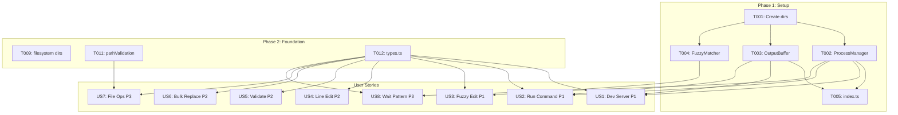

# Tasks: Enhanced Agent Tools

**Input**: Design documents from `/specs/010-tool-enhance/`
**Prerequisites**: plan.md ✅, spec.md ✅, research.md ✅, data-model.md ✅, contracts/ ✅

**Tests**: Tests are REQUIRED for this feature (>80% test coverage per SC-007).

**Organization**: Tasks are grouped by user story to enable independent implementation and testing.

## Format: `[ID] [P?] [Story?] Description`

- **[P]**: Can run in parallel (different files, no dependencies on incomplete tasks)
- **[Story]**: Which user story (US1-US8) - Setup/Foundational phases have no story label
- Include exact file paths in descriptions

## Path Conventions (VS Code Extension)

- **Source**: `extension/src/agents/tools/`
- **Tests**: `extension/test/agents/tools/`
- **Infrastructure**: `extension/src/agents/tools/infrastructure/`

---

## Phase 1: Setup (Shared Infrastructure)

**Purpose**: Create foundational infrastructure components that all tools depend on

- [ ] T001 Create infrastructure directory structure at extension/src/agents/tools/infrastructure/
- [ ] T002 [P] Implement ProcessManager singleton in extension/src/agents/tools/infrastructure/ProcessManager.ts
- [ ] T003 [P] Implement OutputBuffer ring buffer in extension/src/agents/tools/infrastructure/OutputBuffer.ts
- [ ] T004 [P] Implement FuzzyMatcher with Levenshtein distance in extension/src/agents/tools/infrastructure/FuzzyMatcher.ts (include configurable threshold parameter, default 0.85 per FR-012)
- [ ] T005 Create infrastructure barrel export in extension/src/agents/tools/infrastructure/index.ts
- [ ] T006 [P] Create ProcessManager.test.ts in extension/test/agents/tools/infrastructure/ProcessManager.test.ts
- [ ] T007 [P] Create OutputBuffer.test.ts in extension/test/agents/tools/infrastructure/OutputBuffer.test.ts
- [ ] T008 [P] Create FuzzyMatcher.test.ts in extension/test/agents/tools/infrastructure/FuzzyMatcher.test.ts

**Checkpoint**: Infrastructure ready - ProcessManager, OutputBuffer, FuzzyMatcher all pass tests

---

## Phase 2: Foundational (Blocking Prerequisites)

**Purpose**: Create filesystem tools directory and shared utilities needed by multiple stories

**⚠️ CRITICAL**: No user story work can begin until this phase is complete

- [ ] T009 Create filesystem directory structure at extension/src/agents/tools/filesystem/
- [ ] T010 [P] Create filesystem barrel export in extension/src/agents/tools/filesystem/index.ts
- [ ] T011 [P] Add path validation utility (SEC-001 traversal protection) in extension/src/agents/tools/utils/pathValidation.ts
- [ ] T012 Update extension/src/agents/tools/types.ts with new tool input/output types from data-model.md
- [ ] T013 Update extension/src/agents/tools/system/index.ts to export new terminal tools
- [ ] T014 Update extension/src/agents/tools/coding/index.ts to export new file editing tools

**Checkpoint**: Foundation ready - directory structure complete, types defined

---

## Phase 3: User Story 1 - Agent Starts Development Server (Priority: P1) 🎯 MVP

**Goal**: Agent can start `npm run dev`, immediately continue work, and later check if server is ready

**Independent Test**: Start a process with `start_process`, verify immediate return, check output with `get_process_output`

### Tests for User Story 1

- [ ] T015 [P] [US1] Create startProcess.test.ts in extension/test/agents/tools/system/startProcess.test.ts
- [ ] T016 [P] [US1] Create stopProcess.test.ts in extension/test/agents/tools/system/stopProcess.test.ts
- [ ] T017 [P] [US1] Create getProcessOutput.test.ts in extension/test/agents/tools/system/getProcessOutput.test.ts
- [ ] T018 [P] [US1] Create listProcesses.test.ts in extension/test/agents/tools/system/listProcesses.test.ts

### Implementation for User Story 1

- [ ] T019 [US1] Implement start_process tool in extension/src/agents/tools/system/startProcess.ts
- [ ] T020 [US1] Implement stop_process tool in extension/src/agents/tools/system/stopProcess.ts
- [ ] T021 [US1] Implement get_process_output tool in extension/src/agents/tools/system/getProcessOutput.ts
- [ ] T022 [US1] Implement list_processes tool in extension/src/agents/tools/system/listProcesses.ts
- [ ] T023 [US1] Add ready_pattern detection to ProcessManager for server startup detection
- [ ] T024 [US1] Add extension deactivation cleanup hook for ProcessManager (FR-010) and verify workspace context restriction (SEC-002)

**Checkpoint**: Agent can start dev server, check status, and stop it - all independently testable

---

## Phase 4: User Story 2 - Reliable Command Execution (Priority: P1)

**Goal**: Agent runs command and gets complete output with exit code, even without shell integration

**Independent Test**: Run `echo hello`, verify output contains "hello" with exit code 0

### Tests for User Story 2

- [ ] T025 [P] [US2] Create runCommand.test.ts in extension/test/agents/tools/system/runCommand.test.ts
- [ ] T026 [US2] Add shell integration fallback tests to runCommand.test.ts (extends T025)

### Implementation for User Story 2

- [ ] T027 [US2] Implement run_command tool in extension/src/agents/tools/system/runCommand.ts
- [ ] T028 [US2] Implement shell integration detection with graceful fallback to subprocess (FR-006)
- [ ] T029 [US2] Add timeout handling with partial output capture (FR-007)
- [ ] T030 [US2] Add ANSI escape code cleanup to output (FR-008)
- [ ] T030a [US2] Configure output truncation with 500-line default (head/tail preservation per FR-004)

**Checkpoint**: run_command works with or without shell integration

---

## Phase 5: User Story 3 - Fuzzy Match Editing (Priority: P1)

**Goal**: Agent can edit file even with minor whitespace/indentation differences in old_text

**Independent Test**: Provide `old_text` with wrong indentation, verify edit applies via fuzzy matching

### Tests for User Story 3

- [ ] T031 [P] [US3] Create smartReplace.test.ts in extension/test/agents/tools/coding/smartReplace.test.ts
- [ ] T032 [P] [US3] Add fuzzy match cascade tests (exact → normalized → fuzzy) to smartReplace.test.ts

### Implementation for User Story 3

- [ ] T033 [US3] Implement smart_replace tool in extension/src/agents/tools/coding/smartReplace.ts
- [ ] T034 [US3] Implement match cascade: exact → whitespace-normalized → fuzzy (FR-011)
- [ ] T035 [US3] Add start_line_hint for middle-out fuzzy search (FR-013)
- [ ] T036 [US3] Add occurrence parameter for multiple matches (FR-014)
- [ ] T037 [US3] Add dry_run mode with diff preview (FR-020)

**Checkpoint**: smart_replace finds matches that exact matching would miss

---

## Phase 6: User Story 4 - Line Number Editing (Priority: P2)

**Goal**: Agent edits directly by line numbers without text matching

**Independent Test**: Read file, identify line range, call `edit_lines` with that range

### Tests for User Story 4

- [ ] T038 [P] [US4] Create editLines.test.ts in extension/test/agents/tools/coding/editLines.test.ts
- [ ] T039 [P] [US4] Create lineOperations.test.ts in extension/test/agents/tools/coding/lineOperations.test.ts

### Implementation for User Story 4

- [ ] T040 [US4] Implement edit_lines tool in extension/src/agents/tools/coding/editLines.ts
- [ ] T041 [US4] Implement insert_at_line tool in extension/src/agents/tools/coding/insertAtLine.ts
- [ ] T042 [US4] Implement delete_section tool in extension/src/agents/tools/coding/deleteSection.ts
- [ ] T043 [US4] Add preserve_indentation option to edit_lines (FR-016)
- [ ] T043a [US4] Add dry_run mode to edit_lines, insert_at_line, delete_section (FR-020)

**Checkpoint**: edit_lines, insert_at_line, delete_section all work independently with dry_run support

---

## Phase 7: User Story 5 - Pre-Flight Validation (Priority: P2)

**Goal**: Agent validates edit before applying to catch syntax errors

**Independent Test**: Propose edit that causes syntax error, verify validation catches it

### Tests for User Story 5

- [ ] T044 [P] [US5] Create validateEdit.test.ts in extension/test/agents/tools/coding/validateEdit.test.ts

### Implementation for User Story 5

- [ ] T045 [US5] Implement validate_edit tool in extension/src/agents/tools/coding/validateEdit.ts
- [ ] T046 [US5] Add language diagnostics integration via VS Code API (FR-018)
- [ ] T047 [US5] Add actionable error messages with line numbers and fix suggestions (FR-019)

**Checkpoint**: validate_edit catches syntax errors before they cause retry loops

---

## Phase 8: User Story 6 - Bulk Text Replacement (Priority: P2)

**Goal**: Agent replaces text patterns across multiple files using regex or literal matching

**Independent Test**: Replace `oldFunction(` with `newFunction(` across all `.ts` files

### Tests for User Story 6

- [ ] T048 [P] [US6] Create bulkReplace.test.ts in extension/test/agents/tools/coding/bulkReplace.test.ts
- [ ] T049 [P] [US6] Add regex capture group tests to bulkReplace.test.ts

### Implementation for User Story 6

- [ ] T050 [US6] Implement bulk_replace tool in extension/src/agents/tools/coding/bulkReplace.ts
- [ ] T051 [US6] Add literal text and regex pattern support (FR-026)
- [ ] T052 [US6] Add capture group replacement ($1, $2, etc.) (FR-027)
- [ ] T053 [US6] Add file glob pattern targeting (FR-028)
- [ ] T054 [US6] Add preview_only mode for safe multi-file changes

**Checkpoint**: bulk_replace handles regex with capture groups across multiple files

---

## Phase 9: User Story 7 - File Move/Copy Operations (Priority: P3)

**Goal**: Agent moves or copies files and directories with basic file system operations

**Independent Test**: Move a file, verify it exists at new location

### Tests for User Story 7

- [ ] T055 [P] [US7] Create moveFile.test.ts in extension/test/agents/tools/filesystem/moveFile.test.ts
- [ ] T056 [P] [US7] Create copyFile.test.ts in extension/test/agents/tools/filesystem/copyFile.test.ts
- [ ] T057 [P] [US7] Create moveDirectory.test.ts in extension/test/agents/tools/filesystem/moveDirectory.test.ts

### Implementation for User Story 7

- [ ] T058 [US7] Implement move_file tool in extension/src/agents/tools/filesystem/moveFile.ts
- [ ] T059 [US7] Implement copy_file tool in extension/src/agents/tools/filesystem/copyFile.ts
- [ ] T060 [US7] Implement move_directory tool in extension/src/agents/tools/filesystem/moveDirectory.ts
- [ ] T061 [US7] Add parent directory creation for all file operations (FR-022)
- [ ] T062 [US7] Add path traversal protection using pathValidation utility (SEC-001)

**Checkpoint**: move_file, copy_file, move_directory complete file operations correctly

---

## Phase 10: User Story 8 - Process Output Pattern Waiting (Priority: P3)

**Goal**: Agent waits for specific output from a background process before continuing

**Independent Test**: Start a dev server, wait for "ready" pattern, verify tool returns on match

### Tests for User Story 8

- [ ] T063 [P] [US8] Create waitForPattern.test.ts in extension/test/agents/tools/system/waitForPattern.test.ts
- [ ] T064 [P] [US8] Create sendInput.test.ts in extension/test/agents/tools/system/sendInput.test.ts
- [ ] T065 [P] [US8] Create findPortProcess.test.ts in extension/test/agents/tools/system/findPortProcess.test.ts
- [ ] T066 [P] [US8] Create executeWithRetry.test.ts in extension/test/agents/tools/system/executeWithRetry.test.ts

### Implementation for User Story 8

- [ ] T067 [US8] Implement wait_for_pattern tool in extension/src/agents/tools/system/waitForPattern.ts
- [ ] T068 [US8] Implement send_input tool in extension/src/agents/tools/system/sendInput.ts
- [ ] T069 [US8] Implement find_port_process tool in extension/src/agents/tools/system/findPortProcess.ts
- [ ] T070 [US8] Implement execute_with_retry tool in extension/src/agents/tools/system/executeWithRetry.ts

**Checkpoint**: All P3 terminal tools work independently

---

## Phase 11: Polish & Cross-Cutting Concerns

**Purpose**: Final integration, documentation, and cleanup

- [ ] T071 Register all new tools in extension/src/agents/tools/registry.ts (or update existing registration)
- [ ] T072 Add JSDoc documentation to all public interfaces
- [ ] T073 Run full test suite and verify >80% coverage (SC-007)
- [ ] T074 Test cross-platform compatibility (Windows, macOS, Linux) (NFR-004)
- [ ] T075 Verify ProcessManager cleanup on extension deactivation (SC-006)
- [ ] T076 Update extension README with new tool documentation
- [ ] T077 Audit all tools for CancellationToken support (NFR-003)

---

## Dependencies

## Parallel Execution Opportunities

**Within Phase 1 (all parallel):**

- T002, T003, T004 - Independent infrastructure components
- T006, T007, T008 - Independent test files

**Within User Story 1 (tests parallel, then implementation):**

- T015, T016, T017, T018 - All test files parallel
- T019-T024 - Sequential implementation

**Within User Story 7 (tests parallel, then implementation):**

- T055, T056, T057 - All test files parallel
- T058, T059, T060 - Implementations can be parallel (different files)

---

## Implementation Strategy

### MVP Scope (Ship First)

Complete Phase 1-5 (US1, US2, US3) for MVP:

- Background process management (biggest pain point)
- Reliable command execution with fallback
- Fuzzy file editing

### Incremental Delivery

1. **Day 1-2**: Phase 1 (Infrastructure) + Phase 2 (Foundation)
2. **Day 3-4**: US1 (Dev Server) + US2 (Run Command)
3. **Day 5**: US3 (Fuzzy Edit)
4. **Day 6**: US4 (Line Edit) + US5 (Validate)
5. **Day 7**: US6 (Bulk Replace)
6. **Day 8**: US7 (File Ops) + US8 (Wait Pattern)
7. **Day 9**: Phase 11 (Polish)

---

## Summary

| Phase     | Description             | Tasks        | Parallel        |
| --------- | ----------------------- | ------------ | --------------- |
| 1         | Setup (Infrastructure)  | T001-T008    | 6               |
| 2         | Foundational            | T009-T014    | 4               |
| 3         | US1: Dev Server (P1)    | T015-T024    | 4               |
| 4         | US2: Run Command (P1)   | T025-T030a   | 1               |
| 5         | US3: Fuzzy Edit (P1)    | T031-T037    | 2               |
| 6         | US4: Line Edit (P2)     | T038-T043a   | 2               |
| 7         | US5: Validate Edit (P2) | T044-T047    | 1               |
| 8         | US6: Bulk Replace (P2)  | T048-T054    | 2               |
| 9         | US7: File Ops (P3)      | T055-T062    | 3               |
| 10        | US8: Wait Pattern (P3)  | T063-T070    | 4               |
| 11        | Polish                  | T071-T077    | 0               |
| **Total** |                         | **79 tasks** | **29 parallel** |

**MVP**: Phases 1-5 = 41 tasks (US1, US2, US3)
**Full Feature**: All 79 tasks across 8 user stories
